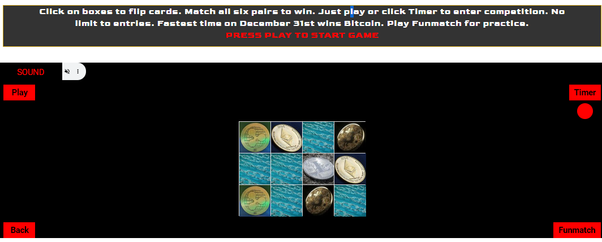
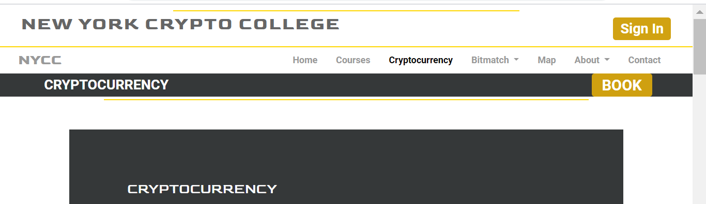
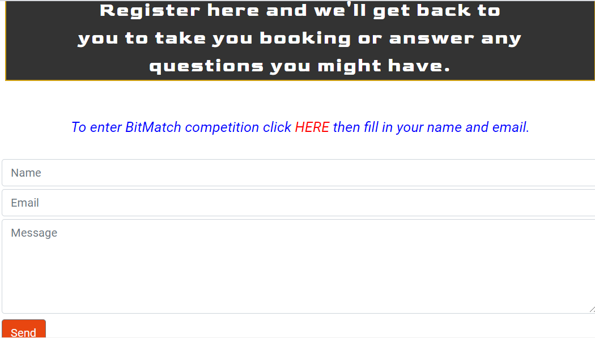

<h1 align="center">New York Crypto College Website</h1>

[View the project live here.](https://johnston9.github.io/ms2-apis/)

This is the website for the New York Crypto College. It's main purpose is to establish the newly founded college’s presence and to attract potential students. People coming to the site who have a minor or real interest in cryptocurrency can not only find out about courses but learn more about the field in an easy and way.

<h2 align="center"></h2>

## User Experience (UX)

This site is intended for people with all levels of interest in cryptocurrency. They may be simply curious about it. They who may have a mild interest in it, or they may already be experimenting or really trading in it. No matter what it is the site is designed to increase their interest and decide to study on one of the courses,
The business goals are for the college to find potential students and establish itself as a leading reputable college in the field, to pique people’s interest to the field and encourage them to want to find out more.

- ### User stories

  - #### First Time Visitor Goals

1. As a First Time Visitor, I want to find out about cryptocurrency.
2. As a First Time Visitor, I want to find out about what courses are on offer and where these courses could take me.
3. As a First Time Visitor, I want to find out about the college, to find reviews and social media links.

   - #### Returning Visitor Goals

4. As a Returning Visitor, I want to be able to easily navigate throughout the site to find content.
5. As a Returning Visitor, I want to find the best way to get in contact with the college.
6. As a Returning Visitor, I want to examine the courses in detail.

   - #### Frequent User Goals

7. As a Frequent User, I want to use the coin data features to find out prices.
8. As a Frequent User, I want to log in to the site to continue my online course.
9. As a Frequent User, I want to play the Bitcoin game.

- ### Design

  - #### Colour Scheme
    - The site aims to have a strong presence created using a black background with white text contrasting with a white background with black and grey text. The touches of gold and silver are to give it a sophisticated and strong flare.

<p align="center">

</p>
  
  - #### Typography
    - Roboto was chosen as the main body font for its clarity and friendly sophistication. It gives a serious but open feel to the site. Goldman was blended in with this for the main titles to give style and an exciting and ever so slightly futuristic feel.

- #### Imagery
  - The landing page has a deep rich serious and sophisticated cryptocurrency image overlaying an image if the New York skyline to give immediate understanding of what the site is all about. The use of strong rich cryptocurrency images throughout the site give it an exciting dynamic feel. The interactive coin all features have a blue and silver background to give them a usable inviting feel. This lies at the heart of the site giving people this approach to cryptocurrency and not overwhelming them with data and graphs.

<p align="center">

</p>

- #### Wireframes

- PDF – MS2 was created in Balsamic for the Home, Cryptocurrency, College and About sections (Reviews and Us. This was where a lot of work went into creating the landing page image and the coin call features look.

- [View on Github](https://github.com/johnston9/ms2-apis)

## Features

### Existing Features

#### Responsive Design

The site is responsive to all sizes and the images remain whole and in proportion at all sizes.

#### Interactive cryptocurrency data fields

The core features are the interactive coin data boxes.
They are designed to have an inviting yet simple feel
encouraging people to use them and get a feel of working
with data even in this manner. Even though the code running
in the background is complex the features are not.

<p align="center">

</p>
    
    
#### Bitmatch game

The site also has a game using cryptocurrency images where people 
can win bitcoin. It has a easier version called Funmatch as well. 
On winning their playertime number and winner number appear with 
a link that takes them to the contact page where they can 
add their numbers to the message box and send in their entry. 
See the user stories section for working images.

<p align="center">

</p>


### Interactive maps

The site has two map features. One showing the college’s position 
in New York and its proximity to the New York Stock Exchange 
and the Union Square apartments. The intention to give people a 
real feel of where the college is and where they could be. 
The other map is interactive and shows places to stay and 
eat in New York and a real time image to take bring even closer.

<p align="center">

</p>

## Technologies Used

### Languages Used

- [HTML5](https://en.wikipedia.org/wiki/HTML5)
- [CSS3](https://en.wikipedia.org/wiki/Cascading_Style_Sheets)
- [JAVASCRIPT](https://en.wikipedia.org/wiki/JavaScript)

### Frameworks, Libraries & Programs Used

1. [Bootstrap 4.4.1:](https://getbootstrap.com/docs/4.4/getting-started/introduction/)
   - Bootstrap was used to assist with the responsiveness and styling of the website.
1. [Google Fonts:](https://fonts.google.com/)
   - Google fonts were used to import the 'Roboto' and ‘Goldman’ font into the site.
1. [Font Awesome:](https://fontawesome.com/)
   - Font Awesome was used throughout the website for the arrow navigation icons.
1. [jQuery:](https://jquery.com/)
   - jQuery was used along with javascript in some of the js files and was used in giving responsivity to the navbar.
1. [Git](https://git-scm.com/)
   - Git was used for version control by utilizing the Gitpod terminal to commit to Git and Push to GitHub.
1. [GitHub:](https://github.com/)
   - GitHub is used to store the projects code after being pushed from Git.
1. [Balsamiq:](https://balsamiq.com/)
   - Balsamiq was used to create the [wireframes](https://github.com/) during the design process.
1. [Favicon-generator](https://www.favicon-generator.org/)
   - Favicon-generator was used to create the favicon link.
1. [Freeformatter](https://www.freeformatter.com/html-formatter.html)
   - Freeformatter was used to tidy up the final code.
1. [Gauger](https://gauger.io/fonticon/)
   - Gauger was used to create the favicon icon.
1. [img-resize.com](https://img-resize.com/):
   - Img-resize was used to resize the game card images.
1. [Am-I-Responsive](http://ami.responsivedesign.is/):
   - Am I Responsive was used to get the responsive sizing landing page image.


### APIs used

1.  [Coingecko](https://www.coingecko.com/api/)

    - Coingecko was use for all the coin data fetch functions.

1.  [Google Maps](https://developers.google.com/maps/documentation/javascript/overview)

    - Google Maps API was used for the Find Us page to show the college’s location in New York. The marker clusters feature was used to set two locations using their coordinates. The info box feature was used on a third location along with a bounce function.
    - The Google Maps API embed feature was also used to call three different place selectors in New York.

1.  [EmailJS](https://www.emailjs.com)
    - EmailJS was used for the contact page.

## Testing

The W3C Markup Validator and W3C CSS Validator Services were used to validate every page of the project to ensure there were no syntax errors in the project.

- [W3C Markup Validator](https://validator.w3.org/) - [Results](https://github.com
- [W3C CSS Validator](https://jigsaw.w3.org/css-validator/#validate_by_input) - [Results](https://github.com /)

### Testing User Stories from User Experience (UX) Section

#### First Time Visitor Goals

1.  As a First Time Visitor, I want to find out about cryptocurrency.

    1. Upon entering the site, users are automatically greeted with a cryptocurrency image expanding towards them below which are three short explanations about the purpose of the site, the first being about cryptocurrency and having a link to a cryptocurrency page where the user can immediately find out about it.
    2. Upon going to that page apart from short intos to various aspect of cryptocurrency there are two interactive cryptocurrency data features which allow the user to engage with crypto data , maybe for the first time, in a controllable and simple manner, hopefully building their confidence and inspiring a desire for knowing more.
    3. Throughout the site and in the navbar there are also links to take the user to the cryptocurrency page.

<p align="center">

</p>

2.  As a First Time Visitor, I want to find out about what courses are on offer and what they consist of.

    1. Under the landing page image is another of the three site goals which introduces the courses and has a link to the courses page.
    2. Upon going to the page, the user will find clearly laid out information about each course and it’s modules.
    3. Throughout the site and in the navbar there are also links to take the user to the courses page.

<p align="center">

</p>

3.  As a First Time Visitor, I want to find out about the college, to find reviews and social media links.

    1. The third site goal introduces the college and has a link to industry testimonials and student reviews so the user can find out all about the college itself and what people say about it.
    2. The user will see clearly see the social media links in the footer on the bottom of any page on the site. They will also find another set of links to the reviews and testimonials.

<p align="center">

</p>

#### Returning Visitor Goals

1. As a Returning Visitor, I want to be able to easily navigate throughout the site to find content and easily go between the different sections.

   1. The site has been designed to be fluid and allow the user to explore all it has to offer as easily as possible and return to the home page at any moment. There is complete interactivity between all the pages and features on the page.
   2. At the top of each page there is a clean navigation bar guiding the user to the different sections.

<p align="center">

</p>

2.  As a Returning Visitor, I want to to get in contact with the college to find out more information about the courses and to book a course..
 
    1.  The navigation bar clearly highlights the "Contact Us" page.
    2.  Throughout the site there are links to the contact page and links to book.
    3.  The user is being constantly encouraged and guided to find out more all leading them to the contact page. Here they will find a message saying to fill in their details to book or to have someone contact them back to answer their questions.
    4.  If they have played and won Bitmatch they can click a box to pass their winner time and number into the message box to enter the competition.

<p align="center">

</p>

3.  As a Returning Visitor, I want to examine the courses in detail.

    1.  The user can easily click on any of the many links to the courses page and go through each course and it’s modules in detail.

<p align="center">

</p>

#### Frequent User Goals

1. As a Frequent User, I want to use the coin data features to find out prices.

   1. The user would already be comfortable with the website layout and can easily locate where they are displayed.

<p align="center">

</p>

2.  As a Frequent User, I want to log in to the site to continue my online course.

    1.  The sign button is at the top when they land on the site.

<p align="center">

</p>

3.  As a Frequent User, I want to play the Bitcoin and Funmatch games.

    1.  The Bitcoin link is at the top when they land on the site.

<p align="center">

</p>

### Further Testing


- The three coin fetch features were tested extensively and all work with no errors.

- The games were tested extensively and all the functions.
     
  -  The onload display.
     The play button with it's shuffle fuction and reset functions.
     The mute function which entailed experimentation with code
     to only get one control box display on screen and the different srcs 
     being set on the one audio.
     The sound functions themselves which threw console errors at first from
     causing interrupted calls which I fixed with set timouts.

  - The on win display of timer number and random winner number worked every time tested.


<p align="center">

</p>

  - These were tested by setting the winner length to 2 instead of 12 as there were numerous 
  tests hense only 2 cards in these images but also worked when set to 12.


<p align="center">

</p>

  - The winner number variables being set in local storage then retrieved on the
  contact page.

<p align="center">

</p>

  - The recieving of the message in gmail.

<p align="center">

</p>

- The info box, bounce function and marker clusters were tested for the Find Us map.

<p align="center">

</p>

- The Website was tested on Google Chrome, Internet Explorer, and Safari browsers.

- The website was viewed on a variety of devices such as Desktop, Laptop, iPhone and various other smartphones.

- A large amount of testing was done to ensure that all pages were linking correctly and that all the API call worked smoothly as well as all aspect of the games.

- Friends and family members were asked to review the site and to point out any bugs and/or user experience issues. These were taken on board and changes were made if necessary or to give a better user experience.

### Known Bugs

## Deployment

### GitHub Pages

The project was deployed to GitHub Pages using the following steps...

1. Log in to GitHub and locate the [GitHub Repository](https://github.com/)
2. At the top of the Repository (not top of page), locate the "Settings" Button on the menu.
   - Alternatively Click [Here](https://raw.githubusercontent.com/) for a GIF demonstrating the process starting from Step 2.
3. Scroll down the Settings page until you locate the "GitHub Pages" Section.
4. Under "Source", click the dropdown called "None" and select "Master Branch".
5. The page will automatically refresh.
6. Scroll back down through the page to locate the now published site [link](https://github.com) in the "GitHub Pages" section.

### Forking the GitHub Repository

By forking the GitHub Repository we make a copy of the original repository on our GitHub account to view and/or make changes without affecting the original repository by using the following steps...

1. Log in to GitHub and locate the [GitHub Repository](https://github.com/)
2. At the top of the Repository (not top of page) just above the "Settings" Button on the menu, locate the "Fork" Button.
3. You should now have a copy of the original repository in your GitHub account.

### Making a Local Clone

1. Log in to GitHub and locate the [GitHub Repository](https://github.com/)
2. Under the repository name, click "Clone or download".
3. To clone the repository using HTTPS, under "Clone with HTTPS", copy the link.
4. Open Git Bash
5. Change the current working directory to the location where you want the cloned directory to be made.
6. Type `git clone`, and then paste the URL you copied in Step 3.

```
$ git clone https://github.com/YOUR-USERNAME/YOUR-REPOSITORY
```

7. Press Enter. Your local clone will be created.

```
$ git clone https://github.com/YOUR-USERNAME/YOUR-REPOSITORY
> Cloning into `CI-Clone`...
> remote: Counting objects: 10, done.
> remote: Compressing objects: 100% (8/8), done.
> remove: Total 10 (delta 1), reused 10 (delta 1)
> Unpacking objects: 100% (10/10), done.
```

Click [Here](https://help.github.com/en/github/creating-cloning-and-archiving-repositories/cloning-a-repository#cloning-a-repository-to-github-desktop) to retrieve pictures for some of the buttons and more detailed explanations of the above process.

## Credits

### Code

- [W3schools.com](https://www.w3schools.com/howto/howto_css_flip_card.asp): Here I learnt how to create the flip card function.

- [W3schools.com](https://www.w3schools.com/howto/howto_js_scroll_to_top.asp): Here I learnt how to create the return to top function.

- [stackoverflow](https://stackoverflow.com/questions/29567580/play-a-beep-sound-on-button-click): Here I learnt how to add sound to a page for the games.

- [Bootstrap4](https://www.w3schools.com/bootstrap4/bootstrap_utilities.asp): Bootstrap docs used throughout the project mainly for positioning.

- [CSS-Tricks](https://css-tricks.com/how-to-stack-elements-in-css/): Here I learnt how to overlay images - used for the landing page image.

- [Medium](https://medium.com/@khaledhassan45/how-to-make-a-simple-matching-game-using-vanilla-js-css-9ace9cd128f6): Here I began learning how to make a matching game.

- [freeCodeCamp](https://marina-ferreira.github.io/tutorials/js/memory-game/): The match card, unflip card, and freeze functions from the Bitmatch game are based on functions from this game.  

- [Ania-Kubov](https://www.youtube.com/watch?v=tjyDOHzKN0w&ab_channel=CodewithAniaKub%C3%B3w%23JavaScriptGames): I got inspiration for my pre-game card flashing images from her Whack-a- Mole game and the use of random numbers.

### Content

- I used lechien73 aka Matt Rudge's README for the Code Institute for the layout of my README.
  [view](https://github.com/Code-Institute-Solutions/SampleREADME#code-institute-website)

* All other content was written by the developer.

### Media

- **The photos used in this site were obtained from;**

  1.  [pixabay.com](https://pixabay.com/images/search/crypto/)

  2.  [pexels.com](https://www.pexels.com)

  3.  [FreePNGImg.com](htps://www.freepngimg.com/)

- **The sounds used in this site were taken from;**

  1.  [freesoundslibrary.com](https://www.freesoundslibrary.com/)

### Acknowledgements

-
